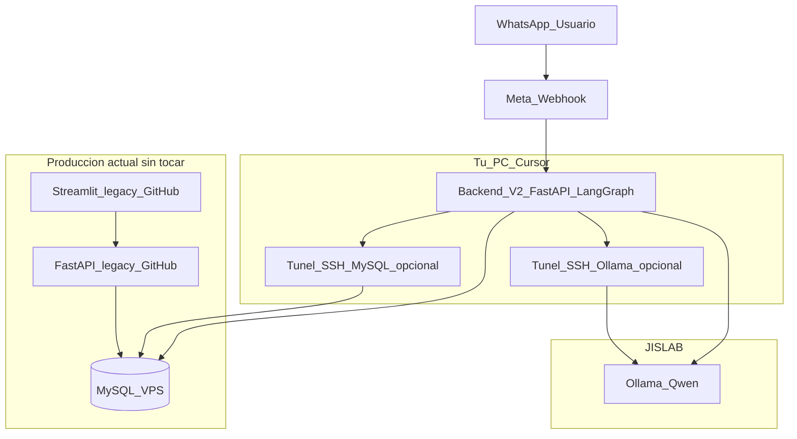

# Plan de desarrollo: JIS Reportes 2.0 (agentico) — versión revisada

Este documento es la **fuente de verdad** del proyecto en el workspace `JIS_REPORTES_2.0`.  
Objetivo: **no tocar** el producto actual [jisreportes.com](https://jisreportes.com) ni sus **dos repositorios de GitHub**; construir **un desarrollo nuevo** en el repo [JIS_REPORTES_2.0](https://github.com/rodrigocabezasz/JIS_REPORTES_2.0) que comparte la **misma base MySQL** y cambia el paradigma a **agente + LLM + canales conversacionales**.

**Referencia de código legacy (fuera de este repo):** [jisreportes_back](https://github.com/rodrigocabezasz/jisreportes_back) · [jisreportes_front](https://github.com/rodrigocabezasz/jisreportes_front).

---

## 1. Principios no negociables

| Principio | Detalle |
|-----------|---------|
| **Producción intacta** | Los repos oficiales `jisreportes_back` y `jisreportes_front` **no se eliminan ni se sustituyen**. Siguen sirviendo reportes, dashboards, **cargas de datos**, **malla horaria** y el resto del ERP de reportería. |
| **Sin copias legacy en este repo** | No se versionan clones de `jisreportes_back` / `jisreportes_front`. Para consultar el código actual, usar los repos oficiales en GitHub (u otro clone local fuera de este proyecto). El desarrollo 2.0 vive solo aquí: **Backend_V2 + toolkit**. |
| **Misma verdad de datos** | JIS Reportes 2.0 lee el **mismo MySQL** que usa jisreportes.com (idealmente usuario **solo lectura** o réplica). No hay “otra base” para KPIs si la fuente oficial es la del VPS. |
| **Repositorio 2.0** | Código en [JIS_REPORTES_2.0](https://github.com/rodrigocabezasz/JIS_REPORTES_2.0). Convive en paralelo con los repos legacy sin reemplazarlos. |

---

## 2. Qué es cada cosa (mapa mental)

- **jisreportes.com (actual):** Streamlit + FastAPI legacy, operaciones completas. **No lo reemplazamos.**
- **JIS Reportes 2.0:** Producto **agentico**: LangGraph + FastAPI (**Backend_V2**) + tools que consultan MySQL + LLM en **JISLAB** (Ollama/Qwen).
- **Primer canal conversacional:** **WhatsApp** (chatbot de consultas sobre datos ya modelados en tools).
- **Segunda fase (después):** Incorporar el mismo tipo de consulta agéntica en el **frontend actual** de jisreportes.com (solo cuando 2.0 esté estable; puede ser un módulo/página que hable con Backend_V2).

---

## 3. Arquitectura objetivo

Desde **tu PC (Cursor)** desarrollas y ejecutas **Backend_V2** (o el servicio del toolkit mientras convergemos). Ese proceso debe poder:

1. Llamar a **Ollama** en JISLAB — vía **IP LAN** (`http://192.168.x.x:11434`) o, si trabajas con túnel, **`http://127.0.0.1:11434`**.
2. Conectarse a **MySQL en el VPS** — directo o mediante **túnel SSH** (ej. puerto local `3307` → `3306` del VPS), según tu red.

**WhatsApp (Meta)** envía webhooks a una URL **pública** (túnel Cloudflare, ngrok, o servidor intermedio) que apunta al **Backend_V2**. El backend orquesta: mensaje → LangGraph → tools (SQL controlado) → respuesta → API de Meta.



---

## 4. Estructura del workspace

```text
JIS_REPORTES_2.0/                    # Repo GitHub JIS_REPORTES_2.0 (monorepo)
├── framework/
│   ├── README.md                    # Nota: toolkit vendido; sin .git interno
│   └── agent-service-toolkit/       # LangGraph + FastAPI + Streamlit demo + extensiones JIS
├── backend_v2/                      # Servicio propio JIS 2.0 (evolución / consolidación)
├── scripts/
│   ├── create_venv.ps1
│   └── verify_connectivity.py       # Ollama + MySQL (+ opcional /info del agente)
├── artifacts/                       # Salidas generadas (reservado)
├── requirements.txt                 # -e toolkit + mysql-connector para scripts
├── .env.example
├── .env                             # Local; nunca commitear
├── README.md
└── PLAN_DESARROLLO_JIS_2.0.md       # Este archivo
```

**`framework/agent-service-toolkit/.env`:** el servicio que arrancas con `python src/run_service.py` lee variables desde ahí (sincronizar con `.env` raíz donde aplique).

**Estado actual:** la lógica agéntica vive **dentro del toolkit** (`jis_tools.py`, `jis_reports_agent.py`). **Fase 1:** consolidar **Backend_V2** en `backend_v2/` o como capa clara encima del toolkit.

---

## 5. Stack tecnológico

| Pieza | Tecnología |
|-------|------------|
| Orquestación | LangGraph |
| API | FastAPI |
| Framework | agent-service-toolkit (base) |
| LLM | Ollama en JISLAB (Qwen u otros modelos instalados) |
| Datos | MySQL (misma instancia / misma BD que jisreportes.com) |
| Canal 1 | WhatsApp Cloud API (Meta) |
| Canal 2 (fase 2) | UI en jisreportes.com actual consumiendo Backend_V2 |
| Python runtime | 3.11–3.13 recomendado; Docker si la PC solo tiene 3.14 |

---

## 6. Variables de entorno — checklist antes de desarrollar

Usa **[.env.example](.env.example)** como plantilla. Completa **`.env` en la raíz** y **`framework/agent-service-toolkit/.env`** con los mismos valores donde aplique (el servicio que arranca hoy lee principalmente el del toolkit).

### 6.1 MySQL (VPS — misma base que jisreportes.com)

| Variable | Uso |
|----------|-----|
| `DB_HOST` | Host alcanzable desde donde corre Backend_V2 (VPS, o `127.0.0.1` si hay túnel) |
| `DB_PORT` | Ej. `3306` o `3307` si mapeas túnel |
| `DB_DATABASE` | Misma BD que el legacy |
| `DB_USER` / `DB_PASSWORD` | Credenciales (preferir usuario **solo SELECT** para 2.0) |
| `DB_READONLY_USER` / `DB_READONLY_PASSWORD` | Alternativa soportada por `jis_tools.py` si ya las usas |

Opcional legacy **MachineJIS:** `DB_*_MACHINEJIS` (solo si alguna tool futura lo necesita).

### 6.2 Ollama (JISLAB)

| Variable | Uso |
|----------|-----|
| `OLLAMA_BASE_URL` | `http://192.168.x.x:11434` en LAN, o `http://127.0.0.1:11434` con túnel SSH activo |
| `OLLAMA_MODEL` | Ej. `qwen2.5-coder:latest` |
| `DEFAULT_MODEL` | `ollama` (toolkit) |

### 6.3 SSH (túneles y documentación; no sustituyen HTTP al LLM)

| Variable | Uso |
|----------|-----|
| `JISLAB_SSH_HOST`, `JISLAB_SSH_USER`, `JISLAB_SSH_PORT` | Referencia para comandos manuales o scripts |
| Comandos típicos (en terminal, **no** como líneas sueltas en `.env`) | Ver comentarios en `.env.example` |

### 6.4 Servicio Backend / toolkit

| Variable | Uso |
|----------|-----|
| `HOST`, `PORT`, `MODE` | Servidor FastAPI del agente |
| `DATABASE_TYPE`, `SQLITE_DB_PATH` | Checkpoints LangGraph (local) |
| `AUTH_SECRET` | Opcional; si se define, cliente envía Bearer |

### 6.5 WhatsApp / Meta

| Variable | Uso |
|----------|-----|
| `META_APP_ID` | App en Meta Developers |
| `META_VERIFY_TOKEN` | Verificación webhook GET |
| `META_ACCESS_TOKEN` o `WHATSAPP_TOKEN` | Token de acceso Graph |
| `WHATSAPP_PHONE_ID` o `WHATSAPP_PHONE_NUMBER_ID` | ID del número de WhatsApp Business |

**URL pública del webhook:** configurar en Meta apuntando a tu túnel/servidor (ej. `https://.../v2/whatsapp/webhook`). Documentar en `.env` opcional: `PUBLIC_WEBHOOK_BASE_URL=`.

### 6.6 Verificación previa al código (cerrar Fase 0)

**Entorno virtual (recomendado antes de instalar dependencias)**

```text
.\scripts\create_venv.ps1
.\.venv\Scripts\Activate.ps1
```

Requiere **Python 3.11–3.13** (ver [README.md](README.md)). Luego `pip install -r requirements.txt` queda hecho por el script.

**Pre-requisitos manuales**

1. Si usas túnel **Ollama:** terminal abierta con  
   `ssh -N -L 11434:localhost:11434 usuario@jislab`  
   y en `.env`: `OLLAMA_BASE_URL=http://127.0.0.1:11434`
2. Si usas túnel **MySQL:** otra terminal con el `-L` hacia el VPS y `DB_HOST` / `DB_PORT` coherentes (ej. `127.0.0.1:3307`).
3. `framework/agent-service-toolkit/.env` y `.env` raíz completos (mismas claves donde aplique).

**Comando principal (desde la raíz `JIS_REPORTES_2.0`)**

```text
python scripts/verify_connectivity.py
```

Debe imprimir **`[OK]`** en **Ollama** y **MySQL**. Si MySQL falla por dependencia:

```text
pip install mysql-connector-python
```

**Opcional — validar que el agente FastAPI responde** (después de arrancar el servicio)

Terminal 1:

```text
cd framework/agent-service-toolkit
python src/run_service.py
```

Terminal 2 (misma raíz del workspace):

```text
python scripts/verify_connectivity.py --check-agent
```

Debe quedar **OK** también en **Agente API /info**.

**Cierre de Fase 0:** los pasos anteriores OK + (recomendado) una prueba manual en navegador: `http://127.0.0.1:8080/docs` o chat Streamlit (`streamlit run src/streamlit_app.py` desde la carpeta del toolkit). Entonces se pasa a desarrollo de **Fase 1** (Backend_V2 / tools).

---

## 7. Fases de desarrollo (orden)

### Fase 0 — Congelar decisiones y entornos

- [ ] `.env` raíz + toolkit completos y verificados con `verify_connectivity.py`
- [ ] Decidir si Backend_V2 arranca solo desde toolkit o se crea paquete `backend_v2/` desde el siguiente sprint
- [ ] Inicializar **nuevo repo Git** en este workspace (cuando quieras) sin mezclar con legacy

### Fase 1 — Backend_V2 (núcleo agéntico)

- Consolidar FastAPI + LangGraph + registro de tools
- Políticas: timeouts SQL, límite de filas, logs de cada tool (auditoría)
- Ampliar tools según prioridad de negocio y, si hace falta contexto del sistema actual, revisar los repos [jisreportes_back](https://github.com/rodrigocabezasz/jisreportes_back) / [jisreportes_front](https://github.com/rodrigocabezasz/jisreportes_front) (clon local aparte)

### Fase 2 — WhatsApp

- Endpoint webhook (verificación + mensajes entrantes)
- Whitelist de números
- Mismo grafo que usa el chat de prueba del toolkit
- Exposición HTTPS (Cloudflare Tunnel u otro)

### Fase 3 — Integración en jisreportes.com actual (segunda parte)

- Nueva página o componente en el **front legacy** que consuma Backend_V2 (API key / JWT según diseño)
- **Sin** romper flujos de carga de datos ni malla; solo capa de consulta agéntica

### Fase 4 — Operación

- Docker / despliegue (opcional JISLAB o VPS dedicado a 2.0)
- Monitoreo y rotación de tokens Meta

---

## 8. Herramientas útiles en el repo

| Recurso | Descripción |
|---------|-------------|
| `scripts/verify_connectivity.py` | Prueba Ollama + MySQL (y opcionalmente `GET /info`) |
| `scripts/create_venv.ps1` | Crea `.venv` e instala `requirements.txt` |
| `framework/.../jis_tools.py` | Tools sucursales + KPI ingresos (SQL alineada al modelo jisreportes) |

---

## 9. Instrucciones para Cursor / IA

- **Producción jisreportes.com:** repos [jisreportes_back](https://github.com/rodrigocabezasz/jisreportes_back) y [jisreportes_front](https://github.com/rodrigocabezasz/jisreportes_front); no forman parte de este árbol. Abrirlos solo si necesitas copiar SQL o contratos de API.
- **Este repo:** Backend_V2, webhooks WhatsApp, extensiones del toolkit.
- **Secretos:** nunca en commits; rotar si se filtran.
- **Ollama:** siempre HTTP; SSH es para túneles o administración.

---

## 10. Próximo paso operativo

Cuando marques la **Fase 0** como lista, el siguiente entregable de código es **Fase 1**: formalizar `backend_v2/` (o documento de arquitectura + primer PR interno) y **Fase 2**: esqueleto del webhook de WhatsApp con variables de §6.5.
